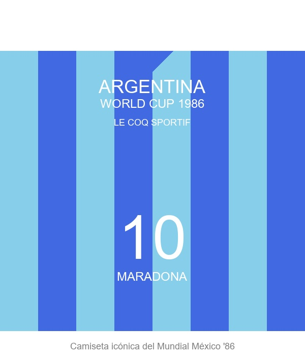
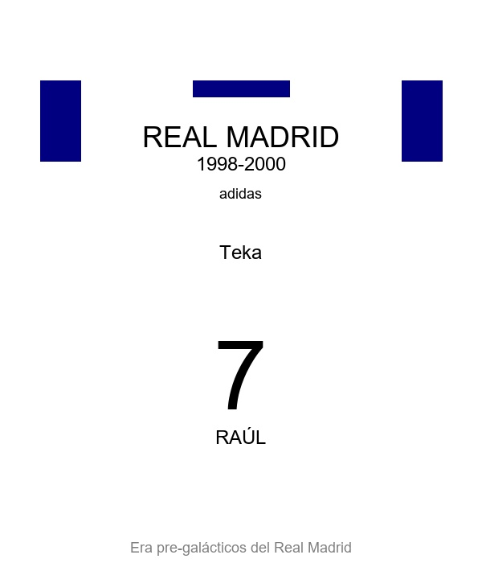

# 👕 CAMISETAS RETRO DS - E-commerce Django

**Tienda online especializada en camisetas retro de fútbol** ⚽

[](https://www.djangoproject.com/)
[](https://getbootstrap.com/)
[](https://fontawesome.com/)

## 🌟 Características Principales

### 🛒 **E-commerce Completo**
- ✅ Catálogo de camisetas retro con filtros
- ✅ Carrito de compras en tiempo real
- ✅ Sistema de órdenes y checkout
- ✅ Gestión de stock automática
- ✅ Ofertas y descuentos

### 👤 **Gestión de Usuarios**
- ✅ Registro y autenticación
- ✅ Perfil personalizado con avatar
- ✅ Historial de compras
- ✅ Sistema de sesiones

### 📱 **Diseño Responsive**
- ✅ Bootstrap 5.1.3
- ✅ Font Awesome icons
- ✅ JavaScript interactivo
- ✅ Optimizado para móviles

### 🔧 **Panel de Administración**
- ✅ Django Admin personalizado
- ✅ Gestión de productos
- ✅ Control de órdenes
- ✅ Estadísticas de ventas

## 📸 Screenshots y Productos Destacados

### 🏠 Página Principal


### 👕 Camisetas Retro Destacadas

#### 🔵 Argentina 1986 - Le Coq Sportif
La icónica camiseta de la selección argentina que Diego Maradona usó en el Mundial de México 1986. Con sus distintivas rayas verticales en azul y celeste, esta camiseta representa uno de los momentos más gloriosos del fútbol mundial.



**Características:**
- 🏆 **Equipo:** Selección Argentina
- 📅 **Año:** 1986
- 👕 **Marca:** Le Coq Sportif
- ⭐ **Estrella:** Diego Armando Maradona

---

#### ⚪ Real Madrid 1998-2000 - Adidas Teka
La elegante camiseta blanca del Real Madrid de finales de los 90s, con el patrocinio de Teka. Una época dorada con galácticos como Raúl, Roberto Carlos y la llegada de futuras leyendas.



**Características:**
- 🏆 **Club:** Real Madrid CF
- 📅 **Temporada:** 1998-2000
- 👕 **Marca:** Adidas
- 💼 **Patrocinador:** Teka
- ⭐ **Estrellas:** Raúl, Roberto Carlos, Fernando Redondo

---

#### 🔴🔵 FC Barcelona 1992-1995 - Kappa
La histórica camiseta del "Dream Team" de Johan Cruyff. Las icónicas rayas blaugrana que vistieron Romário, Stoichkov, Guardiola y compañía durante una de las épocas más brillantes del fútbol catalán.


**Características:**
- 🏆 **Club:** FC Barcelona
- 📅 **Temporada:** 1992-1995
- 👕 **Marca:** Kappa
- 🏆 **Logros:** Liga de Campeones 1992, 4 Ligas consecutivas
- ⭐ **Dream Team:** Romário, Stoichkov, Guardiola, Koeman

### 🛒 Catálogo de Productos


### 🛒 Carrito de Compras


### 👤 Panel de Usuario


## 🚀 Instalación y Configuración

### 🔧 **Requisitos Previos**
- Python 3.10+
- Git (opcional)

### ⚙️ **Configuración del Proyecto**
### 1️⃣ **Instala las dependencias necesarias**
```bash
pip install django==5.2.4
pip install pillow==10.0.0
pip install python-decouple==3.8
```

### 2️⃣ **Configura la base de datos**
```bash
python manage.py makemigrations
python manage.py migrate
```

### 3️⃣ **Inicia el servidor de desarrollo**
```bash
python manage.py runserver
```

### 4️⃣ **¡Accede a tu tienda!**
- 🌐 **Aplicación:** http://127.0.0.1:8000/
- 🔧 **Panel Admin:** http://127.0.0.1:8000/admin/ (crear superusuario si es necesario)

## 🛠️ Stack Tecnológico

| Tecnología | Versión | Uso |
|------------|---------|-----|
| **Django** | 5.2.4 | Backend Framework |
| **Bootstrap** | 5.1.3 | Frontend Framework |
| **Font Awesome** | 6.0.0 | Iconos |
| **JavaScript** | ES6+ | Interactividad |
| **SQLite** | 3.x | Base de Datos |
| **Python** | 3.10+ | Lenguaje |

## 📁 Estructura del Proyecto

```
django83011_mi_primer_app/
├── 🏪 mi_primer_app/          # App principal (e-commerce)
├── 👤 accounts/               # Autenticación y perfiles  
├── 📄 pages/                  # Blog y páginas estáticas
├── ⚙️ mi_primer_proyecto/     # Configuración Django
├── 🎨 templates/             # Plantillas HTML
├── 📊 requirements.txt       # Dependencias
├── 🚫 .gitignore             # Archivos ignorados
└── 📖 README.md              # Esta documentación
```

## ⚽ Funcionalidades del E-commerce

### 🛍️ **Para Clientes**
- 🔍 Búsqueda y filtrado de camisetas
- 👕 Catálogo con ofertas y descuentos
- 🛒 Carrito dinámico con AJAX
- 💳 Proceso de checkout completo
- 📋 Historial de órdenes
- 👤 Perfil personalizado

### 🔧 **Para Administradores**
- 📦 Gestión de inventario
- 📈 Control de órdenes
- 👥 Administración de usuarios
- 💰 Seguimiento de ventas
- 🏷️ Gestión de ofertas

## 🎨 Características del Diseño

- ✅ **Responsive Design** - Se adapta a todos los dispositivos
- ✅ **UX Optimizada** - Navegación intuitiva y fluida
- ✅ **Performance** - Carga rápida con optimizaciones
- ✅ **Accessibility** - Diseño accesible para todos
- ✅ **Modern UI** - Interfaz moderna con Bootstrap 5

## 🔄 API y Funcionalidades AJAX

- 🔄 **Carrito en tiempo real** - Sin recargar página
- 🔍 **Búsqueda instantánea** - Filtros dinámicos
- 📊 **Contador dinámico** - Actualización automática
- ⚡ **Carga asíncrona** - Mejor experiencia de usuario

## 📞 Contacto y Soporte

**Dylan Sayegh** - Desarrollador  
📧 Email: dylansayeg18@gmail.com  
🐙 GitHub: [@dylansayegh](https://github.com/dylansayegh)  

## 📄 Licencia

Este proyecto está bajo la Licencia MIT. Ver el archivo `LICENSE` para más detalles.

---

### 🚀 **¡Gracias por visitar CAMISETAS RETRO DS!**

**¿Te gustó el proyecto?** ⭐ ¡Dale una estrella al repositorio!

**¿Quieres colaborar?** 🤝 ¡Las contribuciones son bienvenidas!
- Si agregas imágenes, colócalas en `static/`
- Puedes personalizar el perfil y la página About a tu gusto

## Video
Agrega aquí el link a tu video de presentación

---
¡Listo para entregar y subir a GitHub!